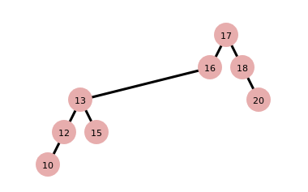

# Splay Tree Visualization

## Example

**insert_natural(15)**

**insert_natural(12)**

**insert_natural(18)**

**insert_natural(10)**

**insert_natural(13)**

**insert_natural(16)**

**insert_natural(20)**

**search(20)**

**search(13)**

**insert_splay(17)**

**delete_splay(15)**

The purpose of this program is to make computer science students  understand all operations in Splay Tree bottom up, such as insert, delete, search, and print with pre-order, in-order, and post-order traversal.

You can use my app [here](https://gigi-g.github.io/SplayTree-JS/).
